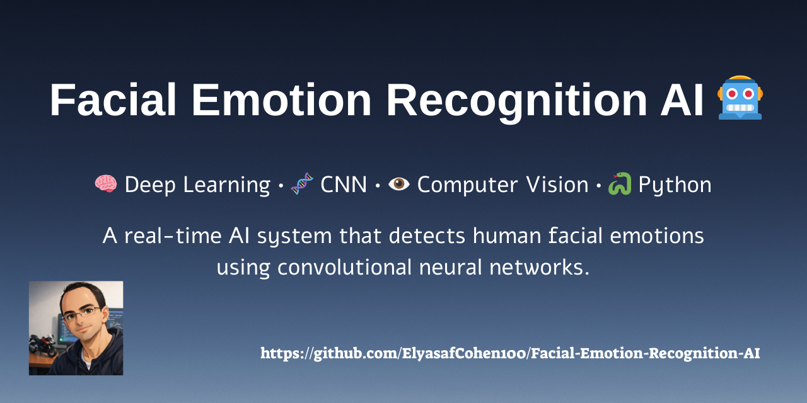

<p align="center">
  
</p>

# 🎭 Facial Emotion Recognition AI 🤖


> **Machine Learning & Computer Vision Project** 💻👀
> A dual-model system for recognizing **human facial emotions** using  
> **Deep Learning (CNN)** and **K-Nearest Neighbors (KNN)** 🎭🤖

---

## 🏷️ Technologies & Tools 🏷️

### 🤖 Machine Learning


### 🧠 Algorithms


### 👁️ Computer Vision


---

## ✨ Overview ✨

This project explores **Facial Emotion Recognition** — the task of automatically detecting human emotions from facial images. 🎞️

The system analyzes facial expressions and predicts emotional states such as:

- 😀 Happy  
- 😠 Angry  
- 😨 Fear  
- 😐 Neutral  
- 😢 Sad  
- 😲 Surprise  

To better explore the problem, the project implements **two different machine learning approaches**:😌

### 🧠 Deep Learning

1. **Convolutional Neural Network (CNN)**  
A neural network that learns visual features directly from images. 🎞️

### 📊 Classical Machine Learning

2. **K-Nearest Neighbors (KNN)**  
A feature-based model using **facial landmarks and geometric distances**. 📏📐

This allows comparing **modern deep learning techniques** with **traditional ML algorithms**. 🚀

---

# 🌟 Model 1 – CNN (Deep Learning) 🌟

The CNN model performs emotion recognition **directly from image pixels**.

### 📊 Model Details 📊

-  🖼 Input images: **48×48 grayscale images converted to RGB**
-  📂 Dataset size: **~35,000 training images**
-  🧠 Architecture:
  - 2 Convolutional layers
  - 1 Dense layer
- ⚙️ Framework: **Keras / TensorFlow**

### 📈 Performance 📈

- 🎯 Accuracy: **~58%**
- 📉 Loss: **~1.02**

The trained model is already included in the repository. 🏋️

---

## 📁 CNN Files 📁

Located in: 🗺️

```
cnn-files/
```

Important scripts: ☝️😌

- `training-48-7-labels.py` – CNN training pipeline  
- `generate-dataset-48-7-labels.py` – dataset preprocessing  
- `test.py` – load trained model and run prediction  

### ▶️ Run CNN Test ▶️

```bash
python cnn-files/test.py
```

---

## 🌟 Model 2 – KNN (Feature Engineering) 🌟

The second approach uses a **custom implementation of a multiclass KNN classifier**. 😎

Instead of raw pixels, the system extracts **facial landmarks** and calculates geometric distances between key facial points.⚡

These measurements become the **feature vector** used by the classifier.🏹

---

## 📊 Model Characteristics 📊

- 🔎 Algorithm: **K-Nearest Neighbors**
- 🔢 K value: **5**
- 📐 Input features:
  - Facial landmark points
  - Distances between landmarks
- 📂 Dataset included in repository

---

## 📁 KNN Files 📁

Located in:

```
knn-files/
```

Important scripts:

- `main.py` – training, testing and camera interface  
- `knn.py` – KNN implementation  
- `heap.py` – priority queue implementation  
- `generate-dataset.py` – feature extraction from images  

---

### ▶️ Run KNN Model ▶️

```bash
python knn-files/main.py
```

The program will:

1️⃣ Train the model  
2️⃣ Activate your webcam 📷  
3️⃣ Capture your face when pressing **SPACE**  
4️⃣ Predict the emotion in real time 🎭

---

## 📁 Project Structure 📁

```
Facial-Emotion-Recognition-AI
│
├── cnn-files/
│   ├── training-48-7-labels.py
│   ├── generate-dataset-48-7-labels.py
│   ├── test.py
│   └── trained CNN model (.keras)
│
├── knn-files/
│   ├── main.py
│   ├── knn.py
│   ├── heap.py
│   ├── generate-dataset.py
│   └── dataset/
│
└── README.md
```

---

## 🧪 Key Concepts Demonstrated 🧪

This project demonstrates several important concepts in **Artificial Intelligence and Machine Learning**:

- 🧠 Deep Learning with CNN  
- 📊 Classical Machine Learning with KNN  
- 👁️ Computer Vision techniques  
- 📐 Feature Engineering using facial landmarks  
- 🧮 Custom data structures (priority queue / heap)  
- 🎥 Real-time emotion recognition using webcam  

---

## 🧑‍💻 Created By 🧑‍💻

- **Elyasaf Cohen** 🧙‍♂️
- **Yakir Yohanan** 💻  
- **Daniel Tzirkin** 🤖

[](https://github.com/danyots)
[](https://github.com/yohanan400)
[](https://github.com/ElyasafCohen100)

---

> ✨ If you like this project – please leave a star! ✨
